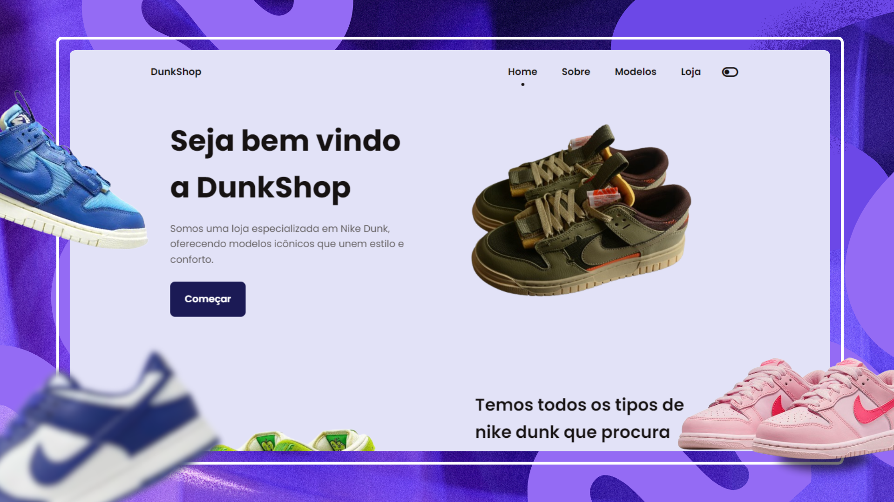
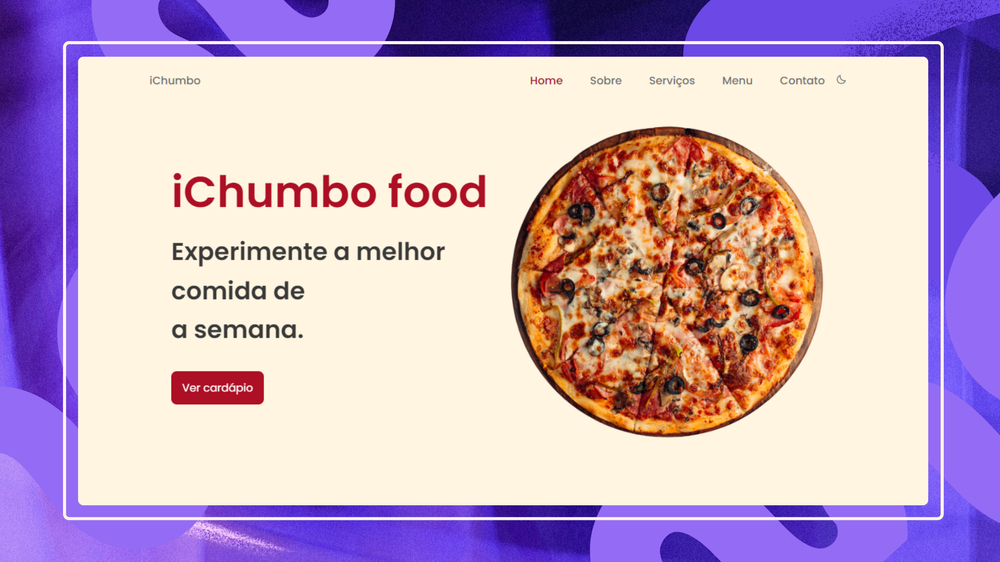
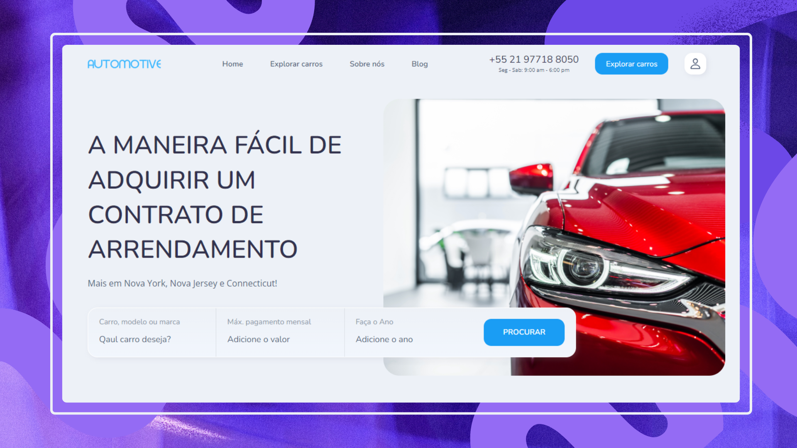
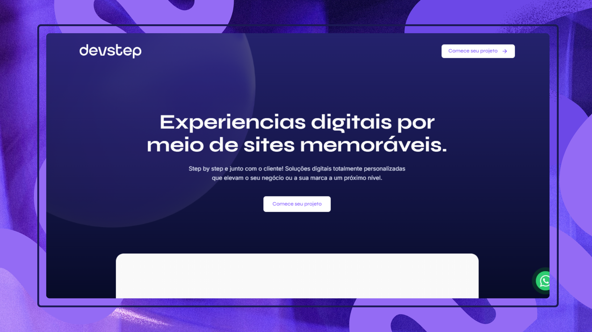
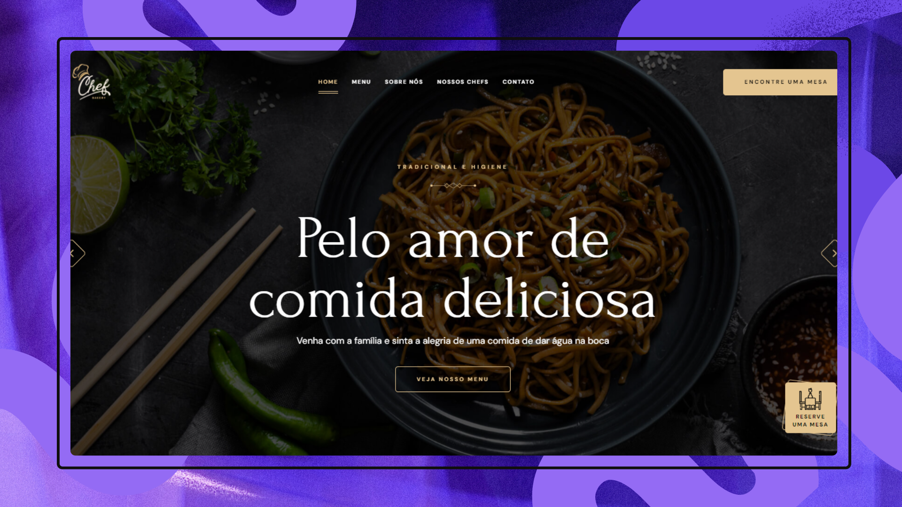

 
    Olá, meu nome é Ian Melo e sou <strong>Desenvolvedor Frontend & Designer</strong>.   
  Atuo na criação de <strong>E-commerces</strong> e <strong>Aplicativos</strong>, com foco em interfaces modernas, intuitivas e responsivas. Minha stack principal inclui <strong>React.JS</strong>, <strong>React Native</strong> e <strong>WordPress</strong>.    
  Sou estudante de <strong>Engenharia da Computação</strong> e trabalho como <strong>freelancer</strong>, criando soluções digitais otimizadas para diferentes negócios. No meu dia a dia, utilizo ferramentas como <strong>JavaScript</strong>, <strong>React.JS</strong>, <strong>React Native</strong> e <strong>WordPress</strong> para desenvolver experiências digitais eficientes e inovadoras.  

    ⚙️ <strong>Linguagens:</strong> 
    
    
    

    📁 <strong>Frontend:</strong> 
    
    
    

    🏭 <strong>Aplicativo:</strong> 
    
    
    

📖 <strong>Alguns Sites: </strong> 
    
    
    
    
    
    

  💌 Contatos para falar comigo: ⤵️

  
  
  

